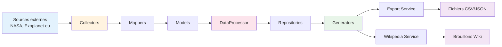
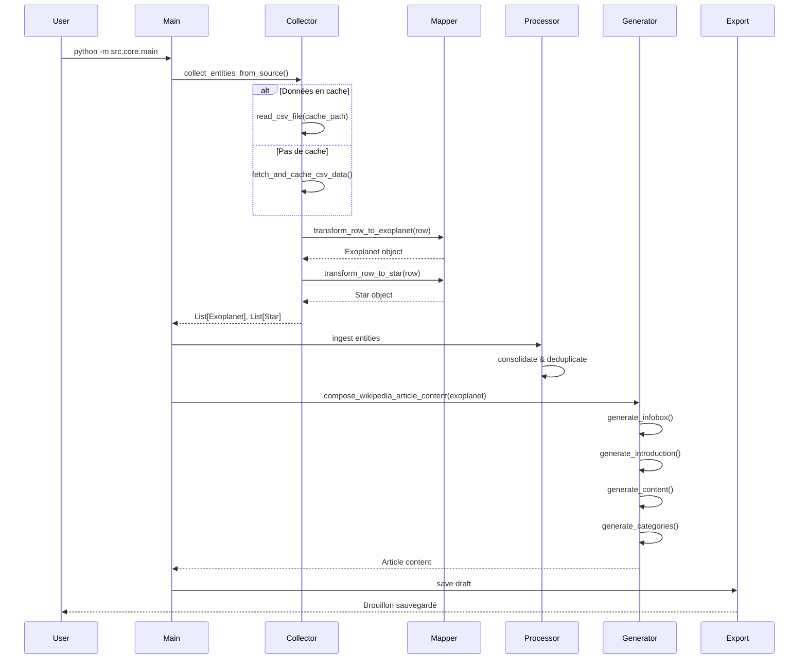
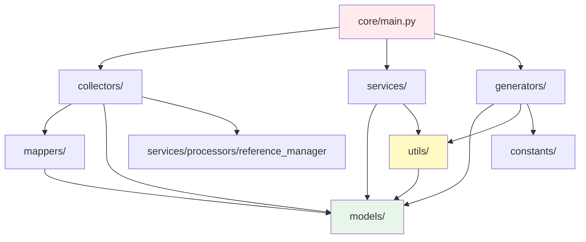

# 🏗️ Architecture du projet AstroWikiBuilder

**Version :** 1.1  
**Date :** 2025-11-19  
**Auteur :** Documentation technique générée

---

## 📋 Vue d'ensemble

AstroWikiBuilder est conçu selon une **architecture en couches modulaires** qui sépare clairement les responsabilités et favorise l'extensibilité. Le projet suit les principes **SOLID** et utilise plusieurs **design patterns** reconnus.

---

## 🎯 Principes architecturaux

### 1. Separation of Concerns (SOC)

Le projet sépare clairement :
- **Collecte de données** (`collectors/`)
- **Transformation de données** (`mappers/`)
- **Logique métier** (`services/`)
- **Persistance** (`repositories/`)
- **Présentation** (`generators/`)
- **Utilitaires** (`utils/`)

### 2. Separation of Responsibilities (SOR)

Chaque module a une responsabilité unique :
- `collectors/` : **Collecte** de données depuis les APIs externes
- `mappers/` : **Transformation** des données brutes en modèles
- `services/processors/` : **Traitement** et consolidation
- `services/external/` : **Communication** avec services externes
- `generators/` : **Génération** de contenu Wikipedia
- `repositories/` : **Accès aux données** consolidées
- `utils/` : **Fonctions utilitaires** réutilisables

### 3. Dependency Inversion Principle (DIP)

Le projet utilise des **abstractions** pour éviter les couplages forts :
- `BaseCollector` (abstrait) ← `NASAExoplanetArchiveCollector` (concret)
- `BaseWikipediaArticleGenerator` (abstrait) ← Générateurs spécifiques (concrets)

---

## 🏛️ Structure modulaire

```
AstroWikiBuilder/
├── src/
│   ├── collectors/          # 🔍 Collecte de données depuis APIs
│   │   ├── base_collector.py
│   │   └── implementations/
│   │       └── nasa_exoplanet_archive.py
│   │
│   ├── mappers/             # 🔄 Transformation données brutes → modèles
│   │   └── nasa_exoplanet_archive_mapper.py
│   │
│   ├── models/              # 🎲 Modèles de données (entités)
│   │   ├── entities/
│   │   │   ├── exoplanet.py
│   │   │   ├── star.py
│   │   │   └── nea_entity.py
│   │   ├── references/
│   │   │   └── reference.py
│   │   └── infobox_fields.py
│   │
│   ├── services/            # ⚙️ Services métier
│   │   ├── processors/
│   │   │   ├── data_processor.py
│   │   │   ├── reference_manager.py
│   │   │   └── statistics_service.py
│   │   ├── repositories/
│   │   │   ├── exoplanet_repository.py
│   │   │   └── star_repository.py
│   │   └── external/
│   │       ├── wikipedia_service.py
│   │       └── export_service.py
│   │
│   ├── generators/          # 📝 Génération d'articles Wikipedia
│   │   ├── base/
│   │   │   ├── base_wikipedia_article_generator.py
│   │   │   ├── base_infobox_generator.py
│   │   │   ├── base_category_generator.py
│   │   │   └── category_rules_manager.py
│   │   └── articles/
│   │       ├── exoplanet/
│   │       │   ├── exoplanet_article_generator.py
│   │       │   └── parts/
│   │       │       ├── exoplanet_infobox_generator.py
│   │       │       ├── exoplanet_introduction_generator.py
│   │       │       ├── exoplanet_content_generator.py
│   │       │       └── exoplanet_category_generator.py
│   │       └── star/
│   │           ├── star_article_generator.py
│   │           └── parts/
│   │               ├── star_infobox_generator.py
│   │               ├── star_introduction_generator.py
│   │               ├── star_content_generator.py
│   │               └── star_category_generator.py
│   │
│   ├── utils/               # 🛠️ Utilitaires réutilisables
│   │   ├── astro/
│   │   │   ├── classification/
│   │   │   │   ├── exoplanet_type_util.py
│   │   │   │   ├── exoplanet_comparison_util.py
│   │   │   │   └── star_type_util.py
│   │   │   └── constellation_util.py
│   │   ├── formatters/
│   │   │   ├── article_formatter.py
│   │   │   ├── infobox_field_formatter.py
│   │   │   └── number_formatter.py
│   │   ├── validators/
│   │   │   └── infobox_validator.py
│   │   ├── wikipedia/
│   │   │   ├── wikipedia_checker.py
│   │   │   └── draft_util.py
│   │   └── lang/
│   │       ├── french_articles.py
│   │       └── phrase/
│   │           └── constellation.py
│   │
│   ├── constants/           # 📐 Configuration et règles
│   │   ├── categories_rules.yaml
│   │   └── wikipedia_field_config.py
│   │
│   ├── core/                # 🚀 Point d'entrée et orchestration
│   │   ├── main.py
│   │   └── config.py
│   │
│   └── pour_plus_tard/      # 📦 Code en attente d'intégration
│       ├── exoplanet_eu.py
│       └── open_exoplanet_catalogue.py
│
├── data/                    # 💾 Données et cache
│   ├── cache/
│   ├── generated/
│   └── drafts/
│
└── tests/                   # ✅ Tests (en cours de développement)
    └── test_references.py
```

---

## 🔄 Flux de données

### Pipeline principal



### Séquence de traitement



---

## 🎨 Design Patterns utilisés

### 1. **Abstract Factory Pattern**

**Localisation :** `collectors/base_collector.py`

**Objectif :** Permettre l'ajout facile de nouvelles sources de données sans modifier le code existant.

```python
# Abstraction
class BaseCollector(ABC):
    @abstractmethod
    def get_data_download_url(self) -> str:
        pass
    
    @abstractmethod
    def transform_row_to_exoplanet(self, row: pd.Series) -> Optional[Exoplanet]:
        pass
    
    @abstractmethod
    def transform_row_to_star(self, row: pd.Series) -> Optional[Star]:
        pass

# Implémentation concrète
class NASAExoplanetArchiveCollector(BaseCollector):
    def get_data_download_url(self) -> str:
        return "https://exoplanetarchive.ipac.caltech.edu/..."
    
    def transform_row_to_exoplanet(self, row: pd.Series) -> Optional[Exoplanet]:
        # Logique spécifique NASA
        pass
```

**Avantages :**
- ✅ Ajout de nouvelles sources sans toucher au code existant
- ✅ Respect du principe Open/Closed (SOLID)
- ✅ Testabilité améliorée (mock facile)

### 2. **Template Method Pattern**

**Localisation :** `collectors/base_collector.py`

**Objectif :** Définir le squelette de l'algorithme de collecte dans la classe de base.

```python
class BaseCollector(ABC):
    def collect_entities_from_source(self) -> Tuple[List[Exoplanet], List[Star]]:
        # Template method
        df = self.load_source_dataframe()          # Étape 1
        if not self.validate_required_columns(df):  # Étape 2
            return [], []
        return self.extract_entities_from_dataframe(df)  # Étape 3
```

**Avantages :**
- ✅ Workflow standardisé
- ✅ Points d'extension clairs pour les sous-classes

### 3. **Composition over Inheritance**

**Localisation :** `generators/articles/`

**Objectif :** Construire des articles complex en composant des générateurs plus simples.

```python
class ExoplanetWikipediaArticleGenerator(BaseWikipediaArticleGenerator):
    def __init__(self):
        self.infobox_generator = ExoplanetInfoboxGenerator()
        self.intro_generator = ExoplanetIntroductionGenerator()
        self.content_generator = ExoplanetContentGenerator()
        self.category_generator = ExoplanetCategoryGenerator()
    
    def compose_article(self, exoplanet):
        article = ""
        article += self.infobox_generator.generate(exoplanet)
        article += self.intro_generator.generate(exoplanet)
        article += self.content_generator.generate(exoplanet)
        article += self.category_generator.generate(exoplanet)
        return article
```

**Avantages :**
- ✅ Chaque générateur a une responsabilité unique
- ✅ Tests unitaires faciles par composant
- ✅ Réutilisabilité maximale

### 4. **Repository Pattern**

**Localisation :** `services/repositories/`

**Objectif :** Abstraire l'accès aux données.

```python
class ExoplanetRepository:
    def get_all_exoplanets(self) -> List[Exoplanet]:
        pass
    
    def get_exoplanet_by_name(self, name: str) -> Optional[Exoplanet]:
        pass
    
    def get_exoplanets_without_wikipedia_article(self) -> List[Exoplanet]:
        pass
```

**Avantages :**
- ✅ Logique d'accès aux données centralisée
- ✅ Facilite le changement de stockage (CSV → BDD)

### 5. **Service Layer Pattern**

**Localisation :** `services/`

**Objectif :** Encapsuler la logique métier complexe.

```python
class DataProcessor:
    """Service de consolidation et traitement des données."""
    def consolidate_data(self, exoplanets, stars):
        pass
    
    def deduplicate_entities(self):
        pass

class StatisticsService:
    """Service de calcul de statistiques."""
    def generate_statistics(self, processor):
        pass

class ReferenceManager:
    """Service de gestion des références bibliographiques."""
    def create_reference(self, source_type, entity):
        pass
```

**Avantages :**
- ✅ Logique métier testable indépendamment
- ✅ Réutilisable par plusieurs parties de l'application

---

## 📦 Modules clés

### 1. `collectors/` - Collecte de données

**Responsabilité :** Récupérer les données depuis les APIs externes et les transformer en entités.

**Classes principales :**
- `BaseCollector` : Classe abstraite définissant le contrat
- `NASAExoplanetArchiveCollector` : Implémentation pour NASA

**Flux :**
1. Télécharger le CSV depuis l'API (ou utiliser le cache)
2. Parser le CSV en DataFrame
3. Valider les colonnes requises
4. Transformer chaque ligne en `Exoplanet` et `Star`
5. Retourner les listes d'entités

**Dépendances :**
- `models.entities` : types de retour
- `services.processors.reference_manager` : création de références

### 2. `mappers/` - Transformation de données

**Responsabilité :** Mapper les données brutes des sources vers nos modèles internes.

**Classes principales :**
- `NASAExoplanetArchiveMapper` : Transformations spécifiques NASA

**Pourquoi séparer de `collectors/` ?**
- Séparation des responsabilités (collecte vs transformation)
- Facilite les tests de mapping indépendamment
- Permet de réutiliser les mappers ailleurs

### 3. `models/` - Modèles de données

**Responsabilité :** Définir les structures de données.

**Classes principales :**
- `Exoplanet` : Représente une exoplanète
- `Star` : Représente une étoile
- `Reference` : Référence bibliographique
- `ValueWithUncertainty` : Valeur scientifique avec incertitude

**Caractéristiques :**
- Utilisation de **dataclasses** Python
- **Type hints** stricts (validés par mypy)
- **Immutabilité** encouragée (frozen=True)

### 4. `services/` - Services métier

**Responsabilité :** Logique métier et orchestration.

**Sous-modules :**

#### `processors/`
- `DataProcessor` : Consolidation et déduplication
- `ReferenceManager` : Gestion des références
- `StatisticsService` : Calcul de statistiques

#### `repositories/`
- `ExoplanetRepository` : Accès aux exoplanètes
- `StarRepository` : Accès aux étoiles

#### `external/`
- `WikipediaService` : Communication avec API Wikipedia
- `ExportService` : Export CSV/JSON

### 5. `generators/` - Génération d'articles

**Responsabilité :** Générer le contenu Wikipedia formaté.

**Architecture hiérarchique :**

```
base/                          # Classes abstraites
├── BaseWikipediaArticleGenerator
├── BaseInfoboxGenerator
└── BaseCategoryGenerator

articles/exoplanet/           # Spécialisations
├── ExoplanetArticleGenerator
└── parts/
    ├── ExoplanetInfoboxGenerator
    ├── ExoplanetIntroductionGenerator
    ├── ExoplanetContentGenerator
    └── ExoplanetCategoryGenerator
```

**Design :** Chaque "part" génère une section spécifique de l'article.

### 6. `utils/` - Utilitaires

**Responsabilité :** Fonctions réutilisables sans logique métier.

**Sous-modules :**

#### `formatters/`
- Formatage des nombres avec unités
- Formatage des incertitudes
- Formatage des champs Infobox

#### `validators/`
- Validation des données Infobox
- Vérification de cohérence

#### `astro/`
- Classification des types de planètes/étoiles
- Utilitaires astronomiques
- Gestion des constellations

#### `wikipedia/`
- Vérification d'existence d'articles
- Helpers pour le formatage Wiki

#### `lang/`
- Gestion des articles français (le/la/l')
- Construction de phrases

### 7. `constants/` - Configuration

**Responsabilité :** Règles et configuration.

**Fichiers :**
- `categories_rules.yaml` : Règles de catégorisation (34 KB)
- `wikipedia_field_config.py` : Configuration des champs

**Exemple de règle de catégorisation :**
```yaml
exoplanet_categories:
  - condition: "découverte_par_kepler == True"
    category: "Exoplanète découverte par Kepler"
  - condition: "masse > 10 * masse_jupiter"
    category: "Exoplanète massive"
```

---

## 🔗 Dépendances entre modules

### Graphe de dépendances



### Règles de dépendance

✅ **Autorisé :**
- Tout module peut dépendre de `models/`
- Tout module peut dépendre de `utils/`
- `core/` peut dépendre de tout
- `generators/` peut dépendre de `constants/`

❌ **Interdit :**
- `models/` ne dépend de rien (sauf typing)
- `utils/` ne dépend que de `models/`
- `constants/` ne dépend de rien
- Pas de dépendances circulaires

---

## ⚙️ Configuration et environnement

### Variables d'environnement

```bash
# User-Agent pour l'API Wikipedia
WIKI_USER_AGENT="AstroWikiBuilder/1.1 (bot; votremail@exemple.com)"
```

### Configuration MyPy (pyproject.toml)

```toml
[tool.mypy]
strict = true                    # Mode strict activé
disallow_untyped_defs = true    # Toutes les fonctions doivent être typées
ignore_missing_imports = true    # Ignorer les imports sans stubs
warn_unused_ignores = true       # Avertir sur les # type: ignore inutiles
```

**Impact :** Garantit un typage strict pour éviter les bugs.

### Dépendances principales

```
requests==2.32.3         # HTTP client
pandas==2.2.3            # Manipulation de données
astroquery==0.4.10       # Requêtes astronomiques
wikipedia==1.4.0         # API Wikipedia
PyYAML==6.0.2           # Configuration YAML
beautifulsoup4==4.13.4   # Parsing HTML (si nécessaire)
```

---

## 🚀 Extensibilité

### Comment ajouter une nouvelle source de données ?

**Étapes :**

1. **Créer un nouveau collector :**
```python
# src/collectors/implementations/exoplanet_eu_collector.py
from src.collectors.base_collector import BaseCollector

class ExoplanetEuCollector(BaseCollector):
    def get_data_download_url(self) -> str:
        return "http://exoplanet.eu/catalog/csv"
    
    def get_source_type(self) -> SourceType:
        return SourceType.EXOPLANET_EU
    
    # Implémenter les autres méthodes abstraites
```

2. **Créer un mapper :**
```python
# src/mappers/exoplanet_eu_mapper.py
class ExoplanetEuMapper:
    def transform_row_to_exoplanet(self, row) -> Exoplanet:
        # Logique de transformation spécifique
        pass
```

3. **Enregistrer dans `core/main.py` :**
```python
def _get_collector_instance(source: str, ...):
    if source == "exoplanet_eu":
        return ExoplanetEuCollector(...)
    # ...
```

**C'est tout !** L'architecture extensible fait le reste.

### Comment ajouter un nouveau type d'article ?

**Exemple : Ajouter des articles pour les systèmes planétaires**

1. **Créer le modèle :**
```python
# src/models/entities/planetary_system.py
@dataclass
class PlanetarySystem:
    name: str
    star: Star
    planets: List[Exoplanet]
```

2. **Créer les générateurs :**
```python
# src/generators/articles/planetary_system/
planetary_system_article_generator.py
parts/
    planetary_system_infobox_generator.py
    planetary_system_introduction_generator.py
    planetary_system_content_generator.py
```

3. **Ajouter au pipeline dans `main.py`**

---

## 🧪 Testabilité

### Architecture favorable aux tests

✅ **Points positifs :**
1. **Injection de dépendances** : Les services reçoivent leurs dépendances
2. **Interfaces abstraites** : Faciles à mocker
3. **Fonctions pures** dans `utils/` : Tests unitaires simples
4. **Séparation claire** : Chaque module testable indépendamment

### Exemple de test

```python
# tests/unit/test_collectors/test_nasa_exoplanet_archive.py
from unittest.mock import Mock, patch
import pandas as pd

def test_transform_row_to_exoplanet():
    collector = NasaExoplanetArchive(
        cache_dir="tests/fixtures",
        use_mock_data=True
    )
    
    # Créer une ligne de test
    row = pd.Series({
        'pl_name': 'Test Planet b',
        'pl_bmasse': 1.5,
        # ...
    })
    
    exoplanet = collector.transform_row_to_exoplanet(row)
    
    assert exoplanet.pl_name == 'Test Planet b'
    assert exoplanet.pl_mass.value == 1.5
```

---

## 📊 Métriques du projet

| Métrique | Valeur |
|----------|--------|
| **Modules principaux** | 10 |
| **Fichiers Python** | ~40 |
| **Lignes de code (src/)** | ~10,000 (estimation) |
| **Classes abstraites** | 3 (BaseCollector, BaseGenerator, etc.) |
| **Design patterns** | 5 (Factory, Template, Repository, Service, Composition) |
| **Couverture de tests** | < 5% ⚠️ |
| **Configuration MyPy** | Strict ✅ |
| **Dépendances externes** | 11 |

---

## 🎯 Prochaines évolutions architecturales

### Court terme
1. **Refactoring de `main.py`** : Créer un module `orchestration/`
2. **Ajout de tests** : Viser 80% de couverture
3. **Documentation des APIs** : Docstrings complètes

### Moyen terme
4. **Event-driven architecture** : Ajouter un bus d'événements
5. **Plugins system** : Permettre des extensions sans modifier le core
6. **Configuration centralisée** : Module `config/` unifié

### Long terme
7. **Microservices** : Séparer collecte, traitement, génération
8. **GraphQL API** : Exposer les données via GraphQL
9. **Machine Learning pipeline** : Classification automatique

---

## 💡 Principes de conception appliqués

### SOLID

✅ **Single Responsibility Principle (SRP)**
- Chaque classe a une responsabilité unique
- Exemple : `ExoplanetInfoboxGenerator` ne génère QUE l'infobox

✅ **Open/Closed Principle (OCP)**
- Extensible via héritage (`BaseCollector`)
- Pas besoin de modifier le code existant pour ajouter une source

✅ **Liskov Substitution Principle (LSP)**
- Toute implémentation de `BaseCollector` est interchangeable

✅ **Interface Segregation Principle (ISP)**
- Interfaces minimales et spécifiques

⚠️ **Dependency Inversion Principle (DIP)**
- Partiellement appliqué (interfaces abstraites)
- Amélioration possible avec injection de dépendances

### DRY (Don't Repeat Yourself)

✅ Code mutualisé dans `utils/`
✅ Logique commune dans classes de base

### KISS (Keep It Simple, Stupid)

✅ Architecture claire et compréhensible
✅ Pas de sur-ingénierie

---

## 🔍 Conclusion

L'architecture d'AstroWikiBuilder est **solide, modulaire et extensible**. Elle suit les meilleures pratiques de conception orientée objet et facilite la maintenance et l'évolution du projet.

**Points forts architecturaux :**
- ✅ Séparation claire des responsabilités
- ✅ Design patterns bien appliqués
- ✅ Extensibilité excellente
- ✅ Typage strict (MyPy)

**Axes d'amélioration :**
- ⚠️ Tests insuffisants
- ⚠️ `main.py` trop volumineux
- ⚠️ Documentation technique à compléter

**Le projet est prêt pour évoluer ! 🚀**
